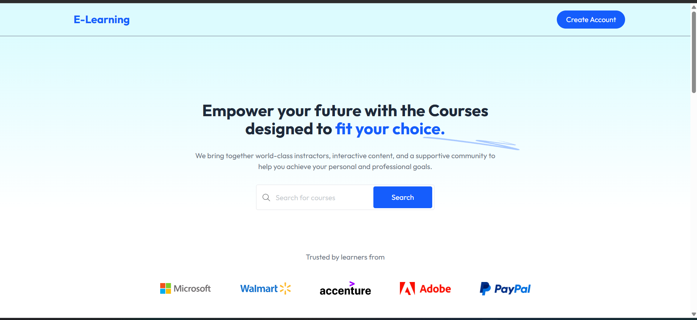
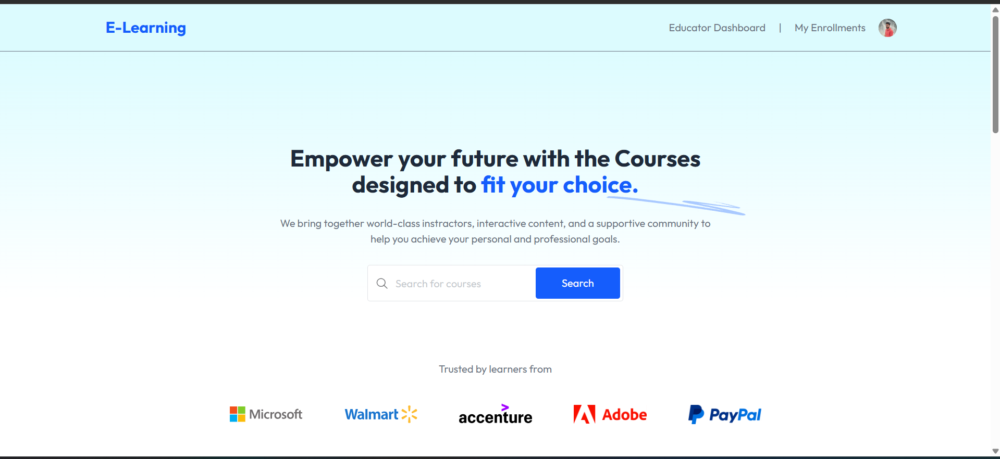

# 🎓 MERN Stack E-Learning App

A full-featured online learning platform built with the MERN stack (MongoDB, Express.js, React.js, Node.js). This app allows users to register, enroll in courses, track progress, and manage content through a clean and responsive UI.

---

## 📚 Features

### 👨‍🎓 User Side

- Register/Login (JWT Auth)
- Browse & Search Courses
- Enroll in Courses
- Video Lessons & Quizzes
- Progress Tracking
- Certificates (optional)

### 👩‍🏫 Admin/Instructor Side

- Create/Edit/Delete Courses
- Upload Videos & Assignments
- Manage Enrollments
- View User Analytics

---

## 🖥️ Tech Stack

| Tech             | Description                                             |
| ---------------- | ------------------------------------------------------- |
| **MongoDB**      | NoSQL database for storing users, courses, and progress |
| **Express.js**   | Backend framework for API development                   |
| **React.js**     | Frontend UI built with functional components and hooks  |
| **Node.js**      | Runtime for the backend                                 |
| **JWT**          | Authentication and authorization                        |
| **Mongoose**     | MongoDB object modeling                                 |
| **Tailwind CSS** | Modern utility-first CSS framework                      |

---

## 🚀 Getting Started

### 1. Clone the Repository

```bash
git clone https://github.com/dev-debabrata/e-learning-mern
cd e-learning-mern

Backend Setup (Server)
cd server
npm install
npm run dev

Frontend Setup (Client)
cd client
npm install
npm run dev

## 📁 Folder Structure
e-learning-mern/
├── client/ # React frontend
├── server/ # Express backend
│ ├── models/ # Mongoose schemas
│ ├── routes/ # API endpoints
│ ├── controllers/ # Business logic
│ └── middleware/ # Auth, error handlers
└── README.md

```

---

## 🙋 Author

Made with ❤️ by Debabrata Das

## 📸 Screenshots

### 👨‍🎓 Student Dashboard



### 📘 Course Page



### 🛠 Admin Panel


